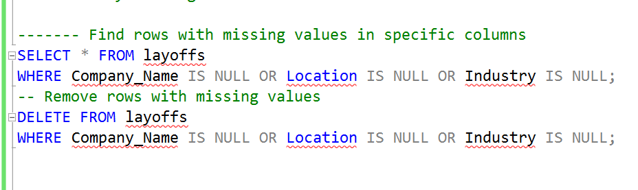
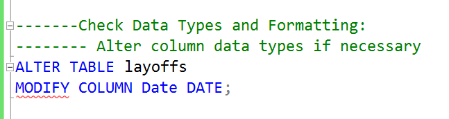
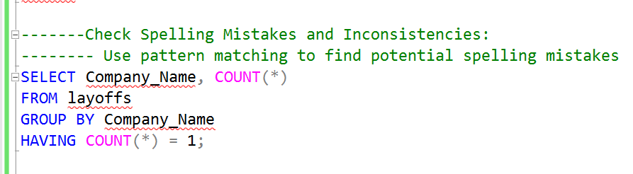
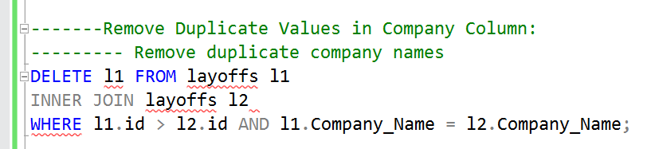
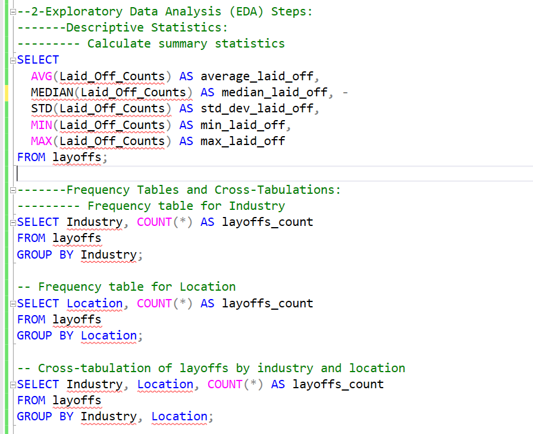
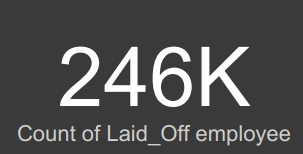
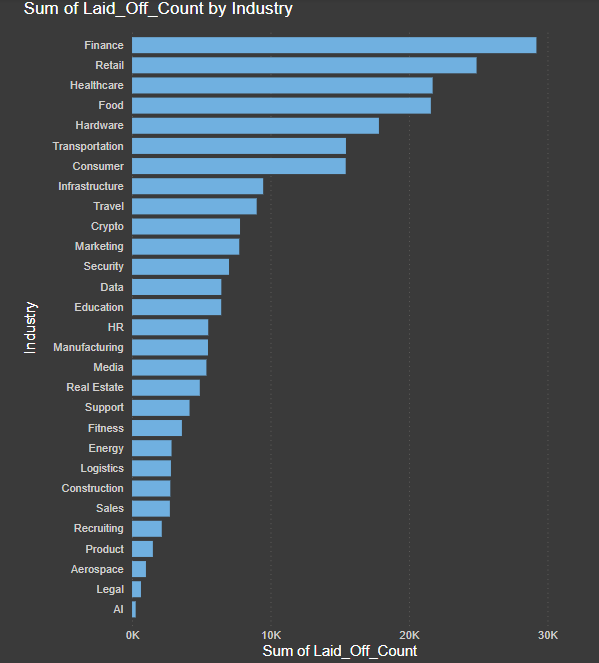
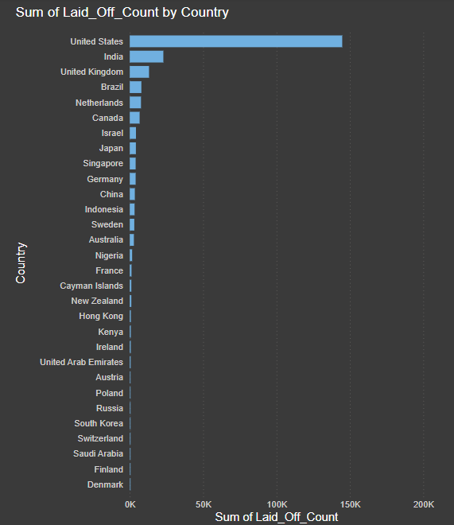
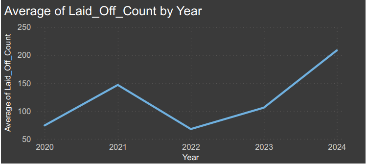
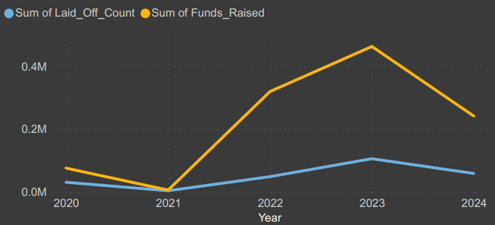

# layoffs Anlysis Project

## Project Description

This project analyzes a dataset of company layoffs, aiming to identify trends and insights based on factors like company, location, and industry.
The data covers layoffs from November-2020 to May-2024. We'll explore how layoffs vary across industries, locations, and time.

## Data Description
The layoffs.xlsx file in the data directory contains the dataset used in this
project.
Columns:
Company Name: Name of the company experiencing layoffs.
Location: Geographic location (city, state, country) of the layoffs.
Industry: Industry sector of the company (e.g., technology, finance,
healthcare).
Laid-Off Counts: Number of employees laid off.
Date: Date the layoffs occurred (format: YYYY-MM-DD).
Percentage: Percentage of the workforce laid off 
## Data Cleaning Steps:
-Identify Missing Values:

-Check Data Types and Formatting:

- Check spelliing mistakes and inconsistencies
  

- remove Duplicates Valus in Company Column:
 

## Exploratory Data Analysis (EDA) Steps:
-Descriptive Statistics:
Calculate summary statistics for numeric columns (Laid-Off Counts,
possibly Percentage):  Mean, median, standard deviation, minimum, and maximum values. Use functions like AVERAGE, MEDIAN, STDEV, MIN, and MAX.

-Frequency Tables and Cross-Tabulations:
Create frequency tables to understand the distribution of layoffs by:

Industry,Location (city, state, country).
Generate cross-tabulations to explore relationships between variables:
layoffs by industry, location and Layoffs by company.

## Visualizations:
-Count of laidoff emplyee: 

       

-Bar charts to compare layoffs by industry, location:

                    

-Line charts to analyze trends in layoffs over time:

-Line charts to analyze trends in raised funds in a company compars to ladioffs employee by the same company:

 

## Conclusion

The Layoffs Analysis Project has provided valuable insights into the patterns and impacts of workforce reductions across various industries and locations from November 2020 to May 2024. Through meticulous data cleaning and exploratory data analysis, we have uncovered that the finance industry and the USA experienced the highest number of layoffs, with a significant peak in 2024, The data suggests a correlation between raised funds and the number of layoffs, indicating that financial influx does not necessarily equate to job security.
In conclusion, this project not only sheds light on the past and present layoff trends but also serves as a call to action for industries to innovate and evolve in ways that support both growth and employment stability.

